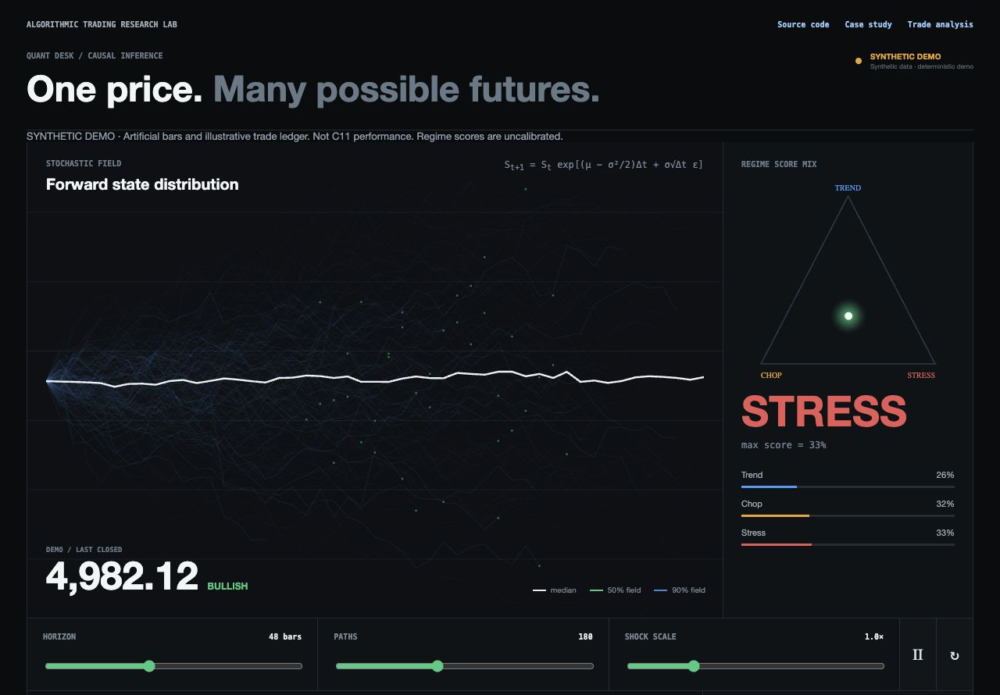
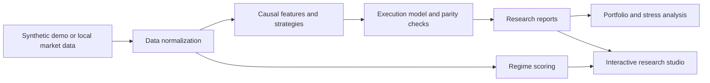

# Algorithmic Trading Research Lab: Python & Pine Script

[](https://github.com/jnaggud/quant-research-lab/actions/workflows/tests.yml)

[](LICENSE)

**A research toolkit for turning trading ideas into testable strategies, reproducible experiments, and interactive dashboards.**

Built by [Jefferson Duggan](https://github.com/jnaggud). The project combines Python research pipelines, Pine Script strategies, TradingView execution-parity checks, and portfolio stress testing. Its focus is the engineering behind a result: causal features, realistic fill assumptions, reproducible inputs, and visible failure cases.



*The public demo uses deterministic synthetic bars and an artificial trade ledger. Its displayed results are illustrative, not C11 backtest or live-trading performance.*

## What it demonstrates

| Capability | Implementation |
| --- | --- |
| Strategy research | Multi-timeframe signals, parameter search, walk-forward evaluation, and ablation studies |
| Execution modeling | Completed-bar signals, next-bar entries, gap-aware stops, costs, and TradingView parity fixtures |
| Risk analysis | Regime block bootstrap, execution stress, portfolio mark-to-market reconciliation, and tail-risk experiments |
| Data engineering | Resumable data downloads, DBN/Parquet processing, options features, and order-book reconstruction |
| Interfaces | Flask/JavaScript research studio, optional Dash monitor, and a prediction-market research dashboard |
| Validation | Causality, fill behavior, report accounting, simulation reproducibility, and offline demo tests |

## Try the demo

**[Open the interactive demo](https://algorithmic-trading-research-lab.jnaggud.chatgpt.site)** · **[Watch the 75-second walkthrough](https://github.com/jnaggud/quant-research-lab/releases/tag/portfolio-demo-v1)**

The hosted dashboard is a static export of the Python-generated synthetic fixtures. No sign-in is needed. To run the Python server locally:

Use Python 3.10 or 3.12. No API keys, TradingView connection, Node.js, or market-data subscription are needed for the demo.

```bash
git clone https://github.com/jnaggud/quant-research-lab.git
cd quant-research-lab
python3 -m venv .venv
source .venv/bin/activate
python -m pip install -e .
python -m dashboard.visual_server --demo
```

Open **http://127.0.0.1:8060**. Adjust the horizon, path count, and shock scale to explore the simulated scenarios. The page labels synthetic inputs and keeps the advisory posture at **observe only**.

On Windows, activate the environment with `.venv\Scripts\Activate.ps1`. Use `--port 8062` if the default port is busy. To export the same synthetic fixtures for inspection:

```bash
python -m dashboard.demo --output data/demo
```

To generate the standalone website locally:

```bash
python -m dashboard.export_demo --output dist/demo
python -m http.server 8060 --directory dist/demo
```

The exporter always uses synthetic inputs, including when live-mode environment variables are set.

## Run the research checks

```bash
python -m pip install -e '.[research,dev]'
python -m pytest -q
```

The public suite runs without data-service credentials. Two historical integration tests skip when their original TradingView exports are absent; [data and reproduction notes](docs/data.md) explain the required inputs. GitHub Actions runs the suite on Python 3.10 and 3.12 and checks the independently installed demo package.

Dependency ranges are declared in [pyproject.toml](pyproject.toml). [requirements-tested.txt](requirements-tested.txt) records the direct package versions used for the publication checks.

## Architecture



[Architecture and assumptions](docs/architecture.md) describe how the components fit together and where the prototype's limits are.

## Repository guide

| Directory | Purpose |
| --- | --- |
| `dashboard/` | Public demo, live adapters, trader statistics, and browser interfaces |
| `quant/` | Features, backtests, options analytics, validation, and risk simulation |
| `polymarket/` | BTC 15-minute contract research and paper-strategy logic |
| `pine_strategies/`, `pine/` | Pine Script strategy implementations and historical variants |
| `scripts/` | Optimization, export, data ingestion, and monitoring utilities |
| `tests/` | Automated checks, including optional private-data integration checks |
| `reports/` | Historical research summaries and derived experiment outputs |
| `archives/`, `checkpoints/` | Preserved strategy versions and research checkpoints |
| `visualizations/` | Optional ManimGL animation source |

## Selected research

- [C11 multi-year transport and validation](reports/c11_multiyear_x_validation_20260714.md): tests how a recent strategy translates across different periods and execution costs.
- [Portfolio simulation validation](reports/es_portfolio_simulation_validation_20260714.md): records mark-to-market and stress assumptions.
- [Quantitative methods audit](reports/quant_desk_publication_audit_20260714.md): distinguishes useful risk methods from unsupported claims about trading edge.
- [Prediction-market strategy validation](reports/JD_PM_BTC_15m_Late_Favorite_C1_validation_20260715.md): documents a separate experimental paper-trading workflow.

These are dated research records. References to an “active” or “production” candidate describe the historical local research baseline, not a verified live deployment. The frozen C11 Pine source is retained; the rejected C11-X variant remains labeled as rejected.

## Optional integrations

See [setup and integrations](docs/setup.md) for the TradingView Desktop bridge, local data roots, research extras, and historical monitoring schedules. Research commands can require substantial data, compute, or paid service access; none are started by the demo.

## Scope and limitations

This is a research and portfolio project. Backtests depend on fill, cost, sizing, and dataset assumptions; they do not establish future performance. Dashboard regime values are independent heuristic scores, not calibrated probabilities. Scenario paths illustrate model assumptions. Raw licensed market data, private exports, credentials, and machine configuration are not distributed.

Original project code is available under the [MIT license](LICENSE). [Third-party notices](THIRD_PARTY_NOTICES.md) retain dependency and source provenance. Data-service rights are separate from the code license.
